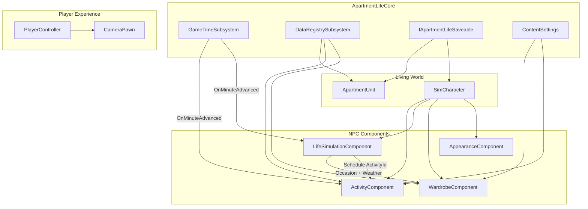

# Architecture

## Design Goals

1. **Nothing waits for the player** — `UApartmentLifeGameTimeSubsystem` advances world time continuously. NPC `UApartmentLifeLifeSimulationComponent` instances subscribe to `OnMinuteAdvanced` and update schedules, economy, and needs independently.

2. **Never hardcode gameplay** — activities, clothing, furniture, customization options, and schedules are `UApartmentLifePrimaryDataAsset` subclasses registered in `UApartmentLifeDataRegistrySubsystem`.

3. **Plugin-friendly expansion** — new content packs add data assets + optional plugin modules without modifying core code.

4. **Save compatibility** — implement `IApartmentLifeSaveable` on any actor/component that owns persistent state. Save IDs are stable strings, not UObject pointers.

## System Diagram



## Module Dependency Graph

```
AdultAnimeApartmentLife (Game)
├── ApartmentLifeCore
├── ApartmentLifeCamera → Core
├── ApartmentLifeCharacter → Core
├── ApartmentLifeWardrobe → Core, Character
├── ApartmentLifeApartment → Core
├── ApartmentLifeAI → Core
└── ApartmentLifeActivities → Core
```

## Camera System

`AApartmentLifeCameraPawn` composes:

- `UApartmentLifeOrbitSpringArmComponent` — collision-aware arm with smooth length interpolation
- `UApartmentLifeCineCameraComponent` — FOV smoothing and photo-mode depth of field

**Modes:** Orbit (default), Free (WASD-style via gamepad left stick), Photo (DoF enabled).

Focus lock smoothly interpolates the orbit pivot to a target actor — ideal for inspecting outfits, furniture, and characters.

## Character System

`UApartmentLifeCharacterAppearanceComponent` applies `FApartmentLifeCharacterAppearanceState` to skeletal meshes:

- Height via uniform scale
- Morph targets for face and body proportions
- Material parameter overrides for skin, eyes, hair, makeup
- Data asset `UApartmentLifeCharacterCustomizationData` defines available options per archetype

## Wardrobe System

`UApartmentLifeWardrobeComponent` manages:

- Layered slots (underwear → outer → accessories)
- Closet inventory as `FName` asset IDs
- `SelectOutfitForContext()` — scores clothing by occasion, weather warmth, and mature content flags
- Laundry state machine: Clean → Worn → Dirty → InWash → Drying

## Apartment System

`AApartmentLifeApartmentUnit` owns `FApartmentLifeFurniturePlacement` arrays. Each placement has a stable `FGuid` for save compatibility.

`UApartmentLifeFurniturePlacementComponent` spawns/despawns furniture actors from `UApartmentLifeFurnitureItemData` meshes.

Supported room types: Living Room, Kitchen, Dining Room, Bedroom, Bathroom, Walk-In Closet, Laundry Room, Balcony, Office.

## AI Life Simulation

`UApartmentLifeLifeSimulationComponent` per NPC tracks:

| Domain | Structure |
|--------|-----------|
| Schedule | `TArray<FApartmentLifeScheduleEntry>` |
| Economy | `FApartmentLifeEconomyState` (income, savings, bills, budgets) |
| Personality | `FApartmentLifePersonalityProfile` |
| Relationships | `TArray<FApartmentLifeRelationshipState>` |
| Memories | `TArray<FApartmentLifeMemoryEntry>` |

Income tier drives apartment quality, furniture budget, clothing, electronics, and entertainment — extend via Blueprint based on `ComputeLifestyleBudgetTier()`.

## Activity System

`UApartmentLifeActivityData` defines:

- Category (cooking, hygiene, intimate, bodily function, etc.)
- Duration in game minutes
- Animation montage ID
- Privacy and explicit content requirements

`UApartmentLifeActivityComponent::StartActivity()` validates content settings, subscribes to world time, and fires completion delegates for AnimBP/Blueprint response.

## Content Gating

`UApartmentLifeContentSettings` (Project Settings → Apartment Life) controls:

- Maturity rating
- Explicit activities
- Nudity
- Bodily functions

Data assets set `bRequiresExplicitContent` or `bRequiresMatureContent`; runtime checks gate execution.

## Save Strategy (Phase 1)

Current foundation uses `IApartmentLifeSaveable::CaptureSaveData` key-value maps. Phase 2 will add:

- `USaveGame` aggregation in a `UApartmentLifeSaveSubsystem`
- Versioned serialization schema per save slot
- Primary Asset ID references instead of raw pointers

## Graphics Configuration

`Config/DefaultEngine.ini` enables:

- Lumen GI + reflections
- Virtual shadow maps
- Mesh distance fields
- HDR exposure extension

Materials and post-process are authored in Content; see CONTENT_PIPELINE.md.

## Extension Checklist

To add a new daily activity:

1. Create `DA_Activity_YourActivity` inheriting `UApartmentLifeActivityData`
2. Set `AssetId`, `Category`, `DurationMinutes`, `MontageId`
3. Register in Primary Asset Manager under type `Activity`
4. Hook AnimBP to `OnActivityStarted` on the character's `UApartmentLifeActivityComponent`

To add a new clothing item:

1. Create `DA_Clothing_YourItem` inheriting `UApartmentLifeClothingItemData`
2. Assign mesh, layer, category, seasonal tags
3. Add `AssetId` to character closet inventory
