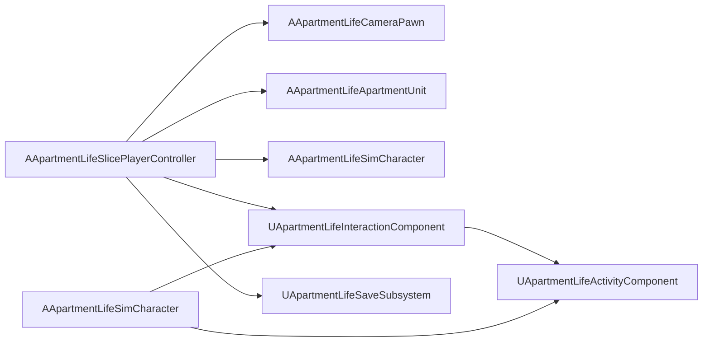

# Vertical Slice

The private **first playable build** proving the full daily loop in one apartment.

## Entry Point

| Setting | Value |
|---------|-------|
| Game mode | `AApartmentLifeVerticalSliceGameMode` |
| Player controller | `AApartmentLifeSlicePlayerController` |
| Default pawn | `AApartmentLifeCameraPawn` |
| Player character | `AApartmentLifeSimCharacter` (spawned, not possessed) |

`Config/DefaultEngine.ini` points the default game mode to the vertical slice. Open any map (e.g. create `Maps/DevSandbox` in editor) and PIE to run the slice.

## What Spawns

On first launch (no save in slot 0):

| Actor | ID | Role |
|-------|-----|------|
| `AApartmentLifeApartmentUnit` | `Apartment_Default` | Apartment root, build mode, inventory |
| `AApartmentLifeSimCharacter` | `player.main` | Player sim character |
| `AApartmentLifeSimCharacter` | `npc.partner` | Partner NPC with starter relationship |

Starter furniture (category-based interactions, no meshes until content assets exist):

| Item ID | Room | Category |
|---------|------|----------|
| `furniture.bed.default` | Bedroom | Bed |
| `furniture.closet.default` | Bedroom | Closet |
| `furniture.sofa.default` | Living room | Sofa |
| `furniture.shower.default` | Bathroom | Bathroom fixture |
| `furniture.mirror.default` | Bathroom | Mirror |
| `furniture.yoga_mat.default` | Living room | Workout equipment |

If slot 0 has a save and `bAutoLoadOnStart` is true, starter furniture is skipped and state is restored after spawn.

## Input

| Key | Action |
|-----|--------|
| Right mouse | Orbit camera |
| Middle mouse | Pan |
| Scroll | Zoom |
| E | Interact (line trace → activity) |
| B | Toggle build mode (+ build camera) |
| T | Toggle top-down camera |
| G | Open wardrobe / outfit focus |
| Q | Talk to partner |
| F5 | Quick save (slot 0) |
| F9 | Quick load (slot 0) |
| Ctrl+Z / Ctrl+Y | Build undo / redo |
| F / P / L | Free cam / photo / focus lock |

## Interaction Flow

```
Player presses E
  → UApartmentLifeInteractionComponent::TryInteractFromView
  → IApartmentLifeInteractable on furniture (or AApartmentLifeFurnitureActor)
  → FName activity id (UApartmentLifeInteractionLibrary defaults)
  → UApartmentLifeActivityComponent::StartActivity on player character
  → Camera focuses furniture (AApartmentLifeCameraPawn::FocusFurniture)
```

Activities include sleep, shower (non-explicit), yoga, wardrobe, grooming, relax, and work stubs defined in `UApartmentLifeInteractionLibrary`.

## Camera Modes

`AApartmentLifeCameraPawn` supports:

- Orbit / pan / zoom (default)
- Top-down and **build mode** camera
- **Furniture focus** after interact
- Character face / outfit / full body
- **Character creator** mode (full body + rotate character)
- Photo mode and free camera

## Save / Load

Quick save uses `UApartmentLifeSaveSubsystem::SaveToSlot(0)`.

Collected state:

- All `IApartmentLifeSaveable` actors and components in the world
- Registered subsystems (social, city) via `FApartmentLifeSaveableRegistry`
- World time and weather

## Architecture Diagram



## Proving the Loop

The slice is complete when you can:

1. Move the camera smoothly
2. Change outfit
3. Enter build mode and place furniture
4. Sleep, shower, and yoga via interact
5. Talk to the partner
6. Save, load, and continue with consistent state

See [SOLO_BUILD.md](SOLO_BUILD.md) for content authoring and expansion order.
