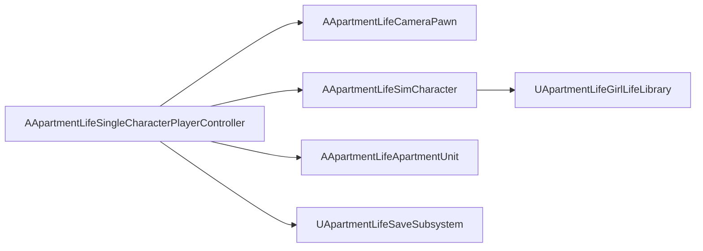

# Vertical Slice → Single Character

The original vertical slice (MP07) proved the daily loop. **MP08 refocused** the project on one girl character.

Use [SINGLE_CHARACTER.md](SINGLE_CHARACTER.md) as the current playable spec.

For MP09 build order and done criteria, see [FIRST_VERTICAL_SLICE.md](FIRST_VERTICAL_SLICE.md).

For camera and interaction polish (MP10), see [CAMERA_MP10.md](CAMERA_MP10.md).

## What Changed (MP08)

| MP07 | MP08 |
|------|------|
| Player + partner NPC | One girl (`character.main`) |
| `AApartmentLifeVerticalSliceGameMode` | `AApartmentLifeSingleCharacterGameMode` |
| Talk to partner (Q) | Talk with girl (Q) |
| City subsystem enabled | City **disabled** in `.uproject` |
| Passive career income | Computer work income on activity complete |
| Partner relationship records | `AffectionTowardPlayer` / `TrustTowardPlayer` |

## Migration

- Save slot 0 from MP07 may not map cleanly (two characters → one). Start a fresh save for MP08 testing.
- Starter furniture now includes **desk** and **kitchen** for work and meals.

## Architecture

